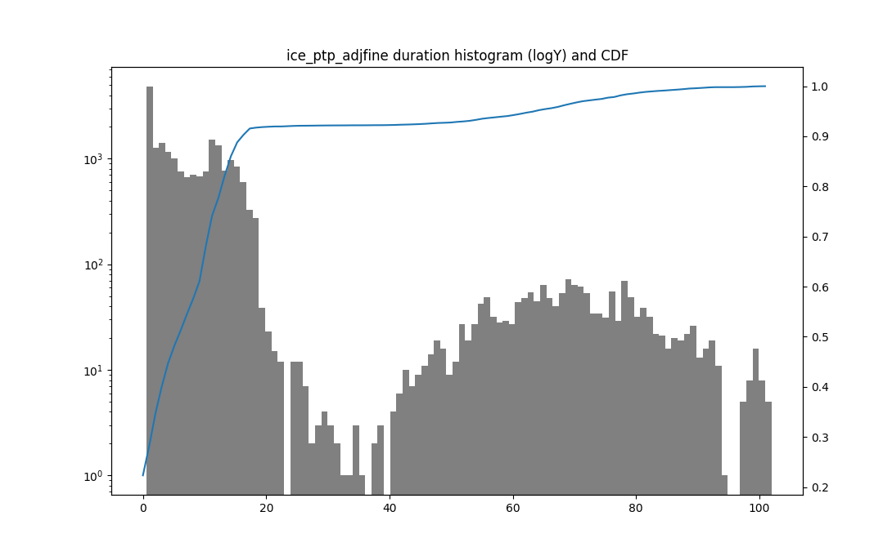

# Visualize function call duration

This repo contains an example of function call duration statistics collected using ftrace and visualized with pyplot.

## The use case ##

PTP grand-leader realized with three Intel E810-XXVDA4T cards. One of the cards has GNSS receiver. Two other cards are synced to the first by 1PPS link. The `ts2phc` program is synchronizing the PHC counters on all the three cards to the nmea stream from the 1st card.
Error of one second in PHC timestamp occured from time to time, leading to the suspicion that PHC update might stuck in the driver. Needed to analyze system call duration statistically.

## ftrace configuration ##

```bash
echo 'function_graph' > current_tracer
echo pc_clock_adjtime >set_graph_function
echo *adjtime*  *ptp* > set_ftrace_filter 
echo funcgraph-abstime > trace_options
echo uptime > trace_clock
```

## Trace example ##
The trace sample is in [sample-trace](./sample-trace)

## Install ##
```bash
python3 -m venv venv
source venv/bin/activate
pip install -r requirements.txt
```
## Run ##
```bash
python3 parse.py sample-trace ice_ptp_adjfine
```
## Results ##
Peaks of 100ms discovered in a 20-minutes run.



